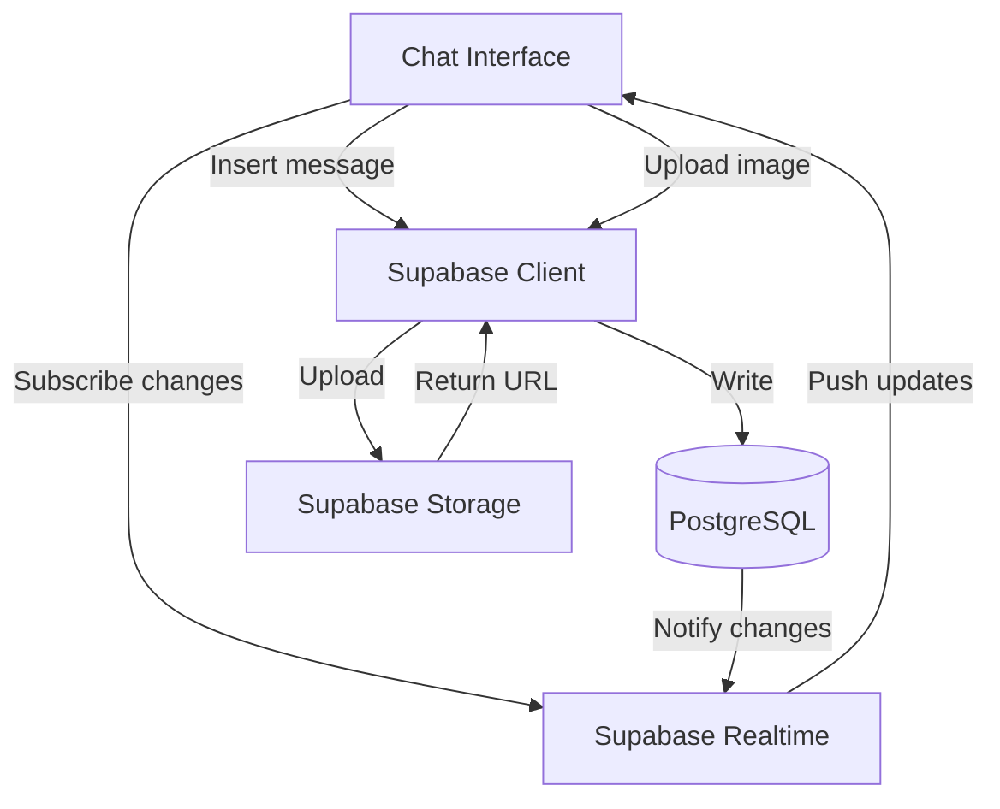

# Tài liệu Thiết kế: Chat và Gửi ảnh

## Tổng quan

Tính năng chat realtime cho phép nhân viên trao đổi thông tin về hồ sơ vay thông qua tin nhắn văn bản và hình ảnh. Hệ thống sử dụng Supabase Realtime để đồng bộ tin nhắn tức thời, Supabase Storage để lưu trữ ảnh, và Optimistic UI để mang lại trải nghiệm mượt mà.

Thiết kế tập trung vào sự đơn giản: chỉ có 2 tính năng chính là gửi tin nhắn văn bản và gửi ảnh. Không có @mention, email notification, hay các tính năng phức tạp khác.

## Kiến trúc

### Tổng quan kiến trúc



### Luồng dữ liệu

**Gửi tin nhắn văn bản:**
1. User nhập tin nhắn và nhấn Enter/Send
2. UI hiển thị tin nhắn ngay lập tức với trạng thái "đang gửi" (Optimistic UI)
3. Client gọi Supabase API để insert vào `loan_activity_logs`
4. Database trigger cập nhật `updated_at`
5. Supabase Realtime phát hiện INSERT event và push đến tất cả clients đang subscribe
6. UI cập nhật trạng thái tin nhắn thành "đã gửi"
7. Các clients khác nhận được tin nhắn mới qua Realtime subscription

**Gửi ảnh:**
1. User chọn ảnh từ file picker
2. UI hiển thị preview ảnh với loading indicator
3. Client upload ảnh lên Supabase Storage bucket `loan-chat-images`
4. Storage trả về public URL
5. Client insert vào `loan_activity_logs` với type='image_upload' và URL trong trường `images`
6. Realtime push update đến tất cả clients
7. UI hiển thị thumbnail ảnh

### Công nghệ sử dụng

- **Frontend**: React + TypeScript
- **Database**: PostgreSQL (Supabase)
- **Realtime**: Supabase Realtime (WebSocket)
- **Storage**: Supabase Storage
- **UI Library**: Tailwind CSS cho styling
- **Image handling**: Browser native File API

## Components và Interfaces

### 1. ChatInterface Component

Component chính hiển thị danh sách tin nhắn và form nhập liệu.

```typescript
interface ChatInterfaceProps {
  loanId: string;
  currentUserId: string;
  currentUserName: string;
}

interface ActivityLog {
  id: string;
  loan_id: string;
  type: 'message' | 'image_upload' | 'system_event';
  user_id: string;
  user_name: string;
  content: string | null;
  system_message: string | null;
  images: string[] | null;
  created_at: string;
}

interface OptimisticMessage extends ActivityLog {
  status: 'sending' | 'sent' | 'error';
  tempId?: string;
}
```

**Responsibilities:**
- Fetch và hiển thị lịch sử tin nhắn khi mount
- Subscribe Realtime changes cho loan_id
- Quản lý optimistic UI state
- Xử lý scroll và pagination (load more khi scroll lên)

### 2. MessageInput Component

Component form nhập tin nhắn và chọn ảnh.

```typescript
interface MessageInputProps {
  onSendMessage: (content: string) => Promise<void>;
  onSendImage: (file: File) => Promise<void>;
  disabled?: boolean;
}
```

**Responsibilities:**
- Render textarea cho nhập tin nhắn
- Render button chọn ảnh
- Validate input (không cho gửi tin nhắn rỗng)
- Hiển thị preview ảnh trước khi gửi
- Xử lý keyboard shortcuts (Enter để gửi, Shift+Enter để xuống dòng)

### 3. MessageBubble Component

Component hiển thị một tin nhắn.

```typescript
interface MessageBubbleProps {
  message: OptimisticMessage;
  isOwnMessage: boolean;
}
```

**Responsibilities:**
- Render tin nhắn với style khác nhau cho tin nhắn của mình và người khác
- Hiển thị avatar, tên người gửi, thời gian
- Hiển thị trạng thái gửi (sending/sent/error)
- Render thumbnail nếu có ảnh
- Xử lý click vào thumbnail để mở image viewer

### 4. ImageViewer Component

Component modal xem ảnh full size.

```typescript
interface ImageViewerProps {
  imageUrl: string;
  isOpen: boolean;
  onClose: () => void;
}
```

**Responsibilities:**
- Hiển thị ảnh ở kích thước đầy đủ
- Cho phép zoom in/out
- Đóng khi click outside hoặc nhấn ESC

### 5. SystemEventBubble Component

Component hiển thị system events (phê duyệt, thanh toán, etc).

```typescript
interface SystemEventBubbleProps {
  event: ActivityLog;
}
```

**Responsibilities:**
- Render system message với style khác biệt (centered, màu xám)
- Hiển thị icon tương ứng với loại event
- Format timestamp

## Data Models

### loan_activity_logs Table

Table này đã tồn tại và đủ cho nhu cầu:

```sql
create table "public"."loan_activity_logs" (
  "id" uuid primary key default gen_random_uuid(),
  "loan_id" uuid not null,
  "type" public.activity_log_type not null,
  "user_id" text not null,
  "user_name" text not null,
  "content" text,
  "system_message" text,
  "links" text[],
  "images" text[],
  "mentions" text[],
  "created_at" timestamp with time zone not null default now(),
  "updated_at" timestamp with time zone not null default now(),
  "deleted_at" timestamp with time zone
);
```

**Cách sử dụng các trường:**

- `type`: 'message' cho tin nhắn văn bản, 'image_upload' cho ảnh, 'system_event' cho sự kiện hệ thống
- `content`: Nội dung tin nhắn văn bản (null nếu là image_upload hoặc system_event)
- `images`: Array các URL ảnh từ Supabase Storage
- `system_message`: Nội dung sự kiện hệ thống (null nếu là message hoặc image_upload)
- `mentions`, `links`: Không sử dụng trong phiên bản đơn giản này

**Index hiện có:**
```sql
CREATE INDEX loan_activity_logs_loan_ts_idx 
ON public.loan_activity_logs 
USING btree (loan_id, created_at DESC);
```

Index này tối ưu cho query lấy tin nhắn theo loan_id và sắp xếp theo thời gian.

### Supabase Storage Structure

```
loan-chat-images/
  {loan_id}/
    {timestamp}_{random}_{filename}
```

**Storage policies:**
- Authenticated users có thể upload
- Public read access cho tất cả ảnh
- File size limit: 5MB
- Allowed types: image/jpeg, image/png, image/webp

## Correctness Properties

*A property is a characteristic or behavior that should hold true across all valid executions of a system-essentially, a formal statement about what the system should do. Properties serve as the bridge between human-readable specifications and machine-verifiable correctness guarantees.*

### Property 1: Message persistence with complete data

*For any* valid message content, user_id, user_name, và loan_id, khi gửi tin nhắn, hệ thống phải lưu một activity log entry với type='message' và tất cả các trường user_id, user_name, content, created_at được lưu chính xác.

**Validates: Requirements 1.2, 1.5**

### Property 2: Optimistic UI state transitions

*For any* tin nhắn được gửi, UI phải hiển thị tin nhắn ngay lập tức với trạng thái 'sending', sau đó chuyển sang 'sent' khi server xác nhận thành công, hoặc 'error' nếu thất bại.

**Validates: Requirements 1.1, 1.3**

### Property 3: Image upload and URL persistence

*For any* valid image file và loan_id, khi upload ảnh, hệ thống phải upload file lên Supabase Storage, nhận về URL, và lưu activity log entry với type='image_upload' và URL trong trường images.

**Validates: Requirements 3.1, 3.2, 3.5**

### Property 4: Image storage path structure

*For any* ảnh được upload cho một loan_id, file path trên storage phải theo format `/loans/{loan_id}/...` để đảm bảo tổ chức dữ liệu rõ ràng.

**Validates: Requirements 3.6**

### Property 5: Thumbnail rendering for images

*For any* activity log entry có images array không rỗng, UI phải render thumbnail của ảnh trong message bubble.

**Validates: Requirements 3.3, 6.5**

### Property 6: Realtime synchronization

*For any* activity log entry mới được tạo trong database, tất cả clients đang subscribe loan_id đó phải nhận được update qua Realtime và hiển thị entry mới.

**Validates: Requirements 5.2, 5.3**

### Property 7: Input preservation during updates

*For any* text đang được nhập trong message input, khi có realtime update từ server, nội dung input phải được giữ nguyên và không bị clear.

**Validates: Requirements 5.5**

### Property 8: Activity logs sorted by time

*For any* loan_id, khi fetch danh sách activity logs, kết quả phải được sắp xếp theo created_at tăng dần (tin nhắn cũ nhất ở trên, mới nhất ở dưới).

**Validates: Requirements 6.1**

### Property 9: Complete message rendering

*For any* activity log entry, UI phải hiển thị đầy đủ user_name, formatted timestamp, và content/images tương ứng với type của entry.

**Validates: Requirements 6.2, 6.3**

## Error Handling

### Upload Errors

**Scenario**: Upload ảnh thất bại do network error hoặc file quá lớn

**Handling**:
- Hiển thị error message rõ ràng cho user
- Cho phép retry upload
- Không tạo activity log entry nếu upload thất bại
- Log error details cho debugging

```typescript
try {
  const { data, error } = await supabase.storage
    .from('loan-chat-images')
    .upload(filePath, file);
  
  if (error) throw error;
  
  // Proceed to create activity log
} catch (error) {
  console.error('Upload failed:', error);
  showErrorToast('Không thể upload ảnh. Vui lòng thử lại.');
  // Keep optimistic UI in error state with retry button
}
```

### Message Send Errors

**Scenario**: Insert vào database thất bại

**Handling**:
- Optimistic message chuyển sang trạng thái 'error'
- Hiển thị retry button
- Lưu message vào localStorage để không mất dữ liệu
- Tự động retry khi connection được khôi phục

```typescript
try {
  const { error } = await supabase
    .from('loan_activity_logs')
    .insert(messageData);
  
  if (error) throw error;
  
  updateOptimisticMessage(tempId, { status: 'sent' });
} catch (error) {
  console.error('Send failed:', error);
  updateOptimisticMessage(tempId, { status: 'error' });
  saveToLocalStorage(messageData);
}
```

### Realtime Connection Errors

**Scenario**: WebSocket connection bị disconnect

**Handling**:
- Hiển thị banner "Đang kết nối lại..."
- Supabase client tự động reconnect
- Khi reconnect thành công, fetch lại messages để đảm bảo không miss updates
- Ẩn banner khi connection stable

```typescript
const channel = supabase
  .channel(`loan:${loanId}`)
  .on('postgres_changes', 
    { event: 'INSERT', schema: 'public', table: 'loan_activity_logs' },
    handleNewMessage
  )
  .subscribe((status) => {
    if (status === 'SUBSCRIBED') {
      setConnectionStatus('connected');
    } else if (status === 'CHANNEL_ERROR') {
      setConnectionStatus('error');
      // Retry logic
    }
  });
```

### File Size Validation

**Scenario**: User chọn file quá lớn (>5MB)

**Handling**:
- Validate trước khi upload
- Hiển thị error message
- Suggest user resize ảnh

```typescript
const MAX_FILE_SIZE = 5 * 1024 * 1024; // 5MB

function validateFile(file: File): string | null {
  if (file.size > MAX_FILE_SIZE) {
    return 'Ảnh quá lớn. Vui lòng chọn ảnh nhỏ hơn 5MB.';
  }
  
  if (!['image/jpeg', 'image/png', 'image/webp'].includes(file.type)) {
    return 'Chỉ hỗ trợ định dạng JPG, PNG, WEBP.';
  }
  
  return null;
}
```

## Testing Strategy

### Dual Testing Approach

Chúng ta sẽ sử dụng cả unit tests và property-based tests để đảm bảo độ tin cậy:

- **Unit tests**: Kiểm tra các trường hợp cụ thể, edge cases, và integration points
- **Property tests**: Kiểm tra các tính chất phổ quát với nhiều inputs ngẫu nhiên

### Property-Based Testing

Sử dụng **fast-check** library cho TypeScript/JavaScript để implement property tests.

**Configuration:**
- Mỗi property test chạy tối thiểu 100 iterations
- Mỗi test phải tag với comment reference đến design property

**Example property test:**

```typescript
import fc from 'fast-check';

/**
 * Feature: chat-va-trao-doi-nhat-ky
 * Property 1: Message persistence with complete data
 */
test('property: message persistence with complete data', async () => {
  await fc.assert(
    fc.asyncProperty(
      fc.uuid(),           // loan_id
      fc.string({ minLength: 1, maxLength: 1000 }), // content
      fc.uuid(),           // user_id
      fc.string({ minLength: 1 }), // user_name
      async (loanId, content, userId, userName) => {
        // Insert message
        const { data, error } = await supabase
          .from('loan_activity_logs')
          .insert({
            loan_id: loanId,
            type: 'message',
            user_id: userId,
            user_name: userName,
            content: content,
          })
          .select()
          .single();
        
        expect(error).toBeNull();
        expect(data.type).toBe('message');
        expect(data.user_id).toBe(userId);
        expect(data.user_name).toBe(userName);
        expect(data.content).toBe(content);
        expect(data.created_at).toBeDefined();
      }
    ),
    { numRuns: 100 }
  );
});
```

### Unit Testing

**Focus areas:**
- Component rendering với specific props
- User interactions (click, type, submit)
- Error states và retry logic
- Edge cases (empty messages, large files, network errors)

**Example unit test:**

```typescript
describe('MessageInput', () => {
  it('should not allow sending empty messages', () => {
    const onSend = jest.fn();
    const { getByRole } = render(<MessageInput onSendMessage={onSend} />);
    
    const sendButton = getByRole('button', { name: /send/i });
    fireEvent.click(sendButton);
    
    expect(onSend).not.toHaveBeenCalled();
  });
  
  it('should show error when file is too large', () => {
    const onSendImage = jest.fn();
    const { getByLabelText, getByText } = render(
      <MessageInput onSendImage={onSendImage} />
    );
    
    const fileInput = getByLabelText(/upload image/i);
    const largeFile = new File(['x'.repeat(6 * 1024 * 1024)], 'large.jpg', {
      type: 'image/jpeg'
    });
    
    fireEvent.change(fileInput, { target: { files: [largeFile] } });
    
    expect(getByText(/quá lớn/i)).toBeInTheDocument();
    expect(onSendImage).not.toHaveBeenCalled();
  });
});
```

### Integration Testing

Test toàn bộ flow từ UI đến database:

```typescript
describe('Chat Integration', () => {
  it('should send message and receive via realtime', async () => {
    const loanId = 'test-loan-id';
    const { getByRole, getByText } = render(
      <ChatInterface loanId={loanId} currentUserId="user1" currentUserName="Test User" />
    );
    
    // Type and send message
    const input = getByRole('textbox');
    fireEvent.change(input, { target: { value: 'Hello world' } });
    fireEvent.click(getByRole('button', { name: /send/i }));
    
    // Should show optimistic message
    expect(getByText('Hello world')).toBeInTheDocument();
    expect(getByText(/sending/i)).toBeInTheDocument();
    
    // Wait for realtime update
    await waitFor(() => {
      expect(getByText(/sent/i)).toBeInTheDocument();
    });
  });
});
```

### Test Coverage Goals

- Unit tests: 80%+ code coverage
- Property tests: Cover all 9 correctness properties
- Integration tests: Cover main user flows (send message, send image, receive updates)
- E2E tests: Test với real Supabase instance (staging environment)
